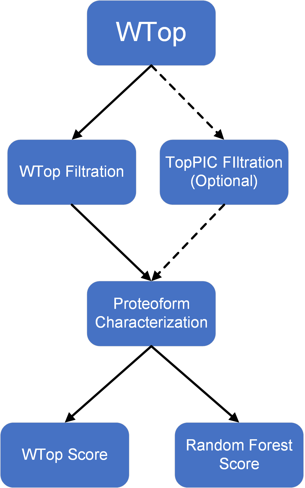

# Configuration

## WTop configuration

The TDMS proteoform characterization process using WTop is as follows
<br><br><br><br>


Under Windows system, use mingw to compile the project and run
```shell
wtop -i r -p r -x config
```

In bin/config_argument, configure the mass spectrometer, input variable modifications, and protein sequence files.

```shell
protein_file_path=D:\data\uniprotkb_9606_AND_model_organism_9606_2024_04_22_target_decoy.fasta

ptm_file_path=D:\data\mods.txt#if you have multi-msalign-file , you can add more path like 

msalign_file_path=D:\data\RM_20190801_NK_F2_01_ms2.msalign

thread_number=20
```


## Candidate protein filtering

```shell
#src/merge/wtop_prsm_processor.cpp

#If you only use WTop's Tag filtering and ion matching rate filtering, use the following function

filterPtr->filtrationProcess(msalign_ptr_container, protein_container, modptr, config_prsm_arg);

# If you need to use filtering combined with TopPIC, use the following function
filterPtr->getToppicFilterResult(msalign_ptr_container, protein_container, modptr, config_prsm_arg);
```

The input filtering results are mass spectrum ID and protein name, split by space character. For example:

```shell
# \bin\total_result
1075 DECOY_sp|O94923|GLCE_HUMAN
1075 sp|Q7L0X2-2|ERIP6_HUMAN
1075 sp|Q70E73-7|RAPH1_HUMAN
1075 sp|P29590-5|PML_HUMAN
822 sp|Q8N7X0-2|ADGB_HUMAN
852 sp|Q8N9W4|GG6L2_HUMAN
852 sp|C9JLR9|ZFTA_HUMAN
852 sp|Q9UPU9-3|SMAG1_HUMAN
```


Score the /bin/out_all_prsm.csv file generated by the program using WTop_RF_Score/WTop_RF_Score.ipynb


